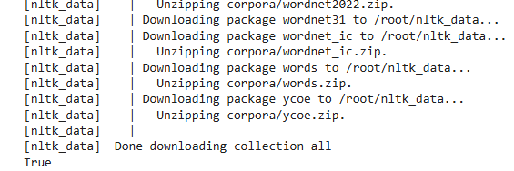

# stemming using python library nltk
## steps:
### Import the librarires
```
import nltk
nltk.download('all')
```
### Output:



### importing the stemmer method
```
from nltk.stem import PorterStemmer
```
### create an instance for the PorterStemmer
```
ps=PorterStemmer()
```
### Consider the words for the stemming
```
words=["Running","jumps","Jumping","Happily","walking","Moving"]
```
### Apply the method to the stemming process

```
stemmed_words[ps.stem(word) for word in words]
```

### Printing the stemmed words
```
print("The Original Word",words,"The words after the stemming",stemmed_words)
```

## Final Code and Output
### code:
```
from nltk.stem import PorterStemmer
ps=PorterStemmer()
words=["Running","jumps","Jumping","Happily","walking","Moving"]
stemmed_words=[ps.stem(word) for word in words]
print("The Original Word",words)
print("The words after the stemming",stemmed_words)

```
### Output:

> The Original Word ['Running', 'jumps', 'Jumping', 'Happily', 'walking', 'Moving']

>The words after the stemming ['run', 'jump', 'jump', 'happili', 'walk', 'move']

## SnowBall Stemming

### code:
```
from nltk.stem import SnowballStemmer
sbs=SnowballStemmer(language='english')
words=["Running","jumps","Jumping","Happily","walking","Moving","Swmming","agreed","Succeed"]
stemmed_words=[sbs.stem(word) for word in words]
print("The Original Word",words)
print("The words after the stemming",stemmed_words)
```
### Output:
> The Original Word ['Running', 'jumps', 'Jumping', 'Happily', 'walking', 'Moving', 'Swmming', 'agreed', 'Succeed']

>The words after the stemming ['run', 'jump', 'jump', 'happili', 'walk', 'move', 'swmming', 'agre', 'succeed']


## Lancaster Stemmer

### code:
```
from nltk.stem import LancasterStemmer
ls=LancasterStemmer()
words=["Running","jumps","Jumping","Happily","walking","Moving","Swmming","agreed","Succeed"]
stemmed_words=[ls.stem(word) for word in words]
print("The Original Word",words)
print("The words after the stemming",stemmed_words)
```

### output:

>The Original Word ['Running', 'jumps', 'Jumping', 'Happily', 'walking', 'Moving', 'Swmming', 'agreed', 'Succeed']

> The words after the stemming ['run', 'jump', 'jump', 'happy', 'walk', 'mov', 'swmming', 'agree', 'success']


